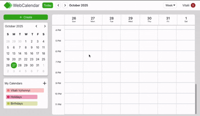

# Web Calendar

## React + TypeScript + Firebase app for creating and managing personal events with calendar filtering, authentication, and real-time data sync.

[Live on Vercel](web-calendar-xi.vercel.app)

 

### Tech Stack:                                
- React
- TypeScript
- Zustand
- Firebase (Auth + Firestore)
- Vite

### Features
- Create / Edit / Delete events
- Filter by calendar
- Presist selected calendars in localStorage
- Real-time updates through Firestore
- Google authentication
- Feature-Sliced Design (FSD) structure

#### Git Clone
```
git clone https://github.com/Vitalii959/webCalendar.git
cd webCalendar
npm install
npm run dev
```
